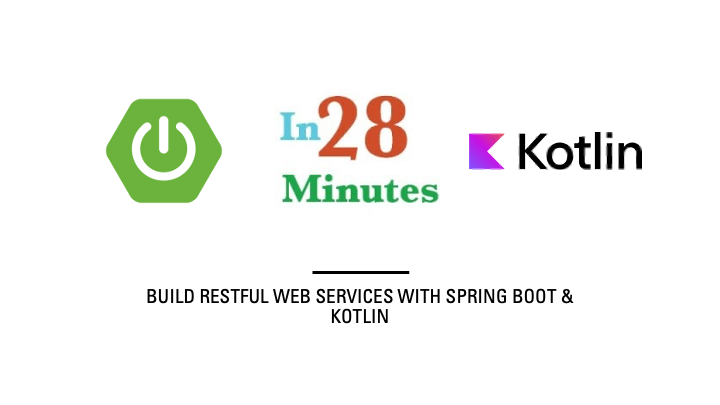

# Building REST API with Spring and Spring Boot with Kotlin



## Steps for Running in Local IDE

To import a pre-existing Spring Boot project developed in Kotlin into IDE,
- Download the zip from [here](https://github.com/in28minutes/master-spring-and-spring-boot/tree/main/12-rest-api-kotlin) or clone the Git repository from [here](https://github.com/in28minutes/master-spring-and-spring-boot/tree/main/12-rest-api-kotlin).
- Unzip the zip file
- **Open IDE:** Start the integrated development environment and, if required, navigate to the welcome interface.
- **Import the project:** Select File > New > Project from Existing Sources.
- **Identify project directory:** Navigate to the main directory of your existing Spring Boot Kotlin project.
- **Select build system:** IDE will automatically identify whether your project utilizes Maven or Gradle; choose the appropriate option. Check that your project's build file (pom.xml for Maven)
- **Finalize import:** Click "Open," and IDE will commence the import process, identifying the Kotlin code and Spring Boot dependencies.

**Java**

```xml
<?xml version="1.0" encoding="UTF-8"?>
<project xmlns="http://maven.apache.org/POM/4.0.0"
	xmlns:xsi="http://www.w3.org/2001/XMLSchema-instance"
	xsi:schemaLocation="http://maven.apache.org/POM/4.0.0 https://maven.apache.org/xsd/maven-4.0.0.xsd">
	<modelVersion>4.0.0</modelVersion>
	<parent>
		<groupId>org.springframework.boot</groupId>
		<artifactId>spring-boot-starter-parent</artifactId>
		<version>3.4.1</version>
		<relativePath /> <!-- lookup parent from repository -->
	</parent>
	<groupId>com.in28minutes.rest.webservices</groupId>
	<artifactId>restful-web-services</artifactId>
	<version>0.0.1-SNAPSHOT</version>
	<name>restful-web-services</name>
	<description>Demo project for Spring Boot</description>
	<properties>
		<java.version>21</java.version>
	</properties>
	<dependencies>
		<dependency>
			<groupId>org.springframework.boot</groupId>
			<artifactId>spring-boot-starter-data-jpa</artifactId>
		</dependency>

		<dependency>
			<groupId>org.springframework.boot</groupId>
			<artifactId>spring-boot-starter-web</artifactId>
		</dependency>

		<dependency>
			<groupId>org.springframework.boot</groupId>
			<artifactId>spring-boot-starter-security</artifactId>
		</dependency>

		<dependency>
			<groupId>org.springframework.boot</groupId>
			<artifactId>spring-boot-starter-actuator</artifactId>
		</dependency>

		<dependency>
			<groupId>org.springframework.data</groupId>
			<artifactId>spring-data-rest-hal-explorer</artifactId>
		</dependency>

		<dependency>
			<groupId>org.springframework.boot</groupId>
			<artifactId>spring-boot-starter-hateoas</artifactId>
		</dependency>

		<dependency>
			<groupId>org.springframework.boot</groupId>
			<artifactId>spring-boot-starter-validation</artifactId>
		</dependency>


		<!-- <dependency> 
				<groupId>org.springdoc</groupId> 
				<artifactId>springdoc-openapi-starter-webmvc-ui</artifactId> 
				<version>2.6.0</version>
			</dependency> 
			<dependency> 
				<groupId>com.fasterxml.jackson.dataformat</groupId> 
				<artifactId>jackson-dataformat-xml</artifactId>
			</dependency> -->

		<dependency>
			<groupId>org.springframework.boot</groupId>
			<artifactId>spring-boot-devtools</artifactId>
			<scope>runtime</scope>
			<optional>true</optional>
		</dependency>

		<dependency>
			<groupId>com.h2database</groupId>
			<artifactId>h2</artifactId>
			<scope>runtime</scope>
		</dependency>

		<!-- <dependency>
			<groupId>mysql</groupId> 
			<artifactId>mysql-connector-java</artifactId> 
			</dependency> -->

		<dependency>
			<groupId>org.springframework.boot</groupId>
			<artifactId>spring-boot-starter-test</artifactId>
			<scope>test</scope>
		</dependency>
	</dependencies>

	<build>
		<plugins>
			<plugin>
				<groupId>org.springframework.boot</groupId>
				<artifactId>spring-boot-maven-plugin</artifactId>
			</plugin>
		</plugins>
	</build>
	<repositories>
		<repository>
			<id>spring-milestones</id>
			<name>Spring Milestones</name>
			<url>https://repo.spring.io/milestone</url>
			<snapshots>
				<enabled>false</enabled>
			</snapshots>
		</repository>
	</repositories>
	<pluginRepositories>
		<pluginRepository>
			<id>spring-milestones</id>
			<name>Spring Milestones</name>
			<url>https://repo.spring.io/milestone</url>
			<snapshots>
				<enabled>false</enabled>
			</snapshots>
		</pluginRepository>
	</pluginRepositories>
</project>
```

**Kotlin**

```xml
<?xml version="1.0" encoding="UTF-8"?>
<project xmlns="http://maven.apache.org/POM/4.0.0" xmlns:xsi="http://www.w3.org/2001/XMLSchema-instance"
	xsi:schemaLocation="http://maven.apache.org/POM/4.0.0 https://maven.apache.org/xsd/maven-4.0.0.xsd">
	<modelVersion>4.0.0</modelVersion>
	<parent>
		<groupId>org.springframework.boot</groupId>
		<artifactId>spring-boot-starter-parent</artifactId>
		<version>3.4.2</version>
		<relativePath/> <!-- lookup parent from repository -->
	</parent>
	<groupId>com.in28minutes.rest.webservices</groupId>
	<artifactId>restful-web-services</artifactId>
	<version>0.0.1-SNAPSHOT</version>
	<name>restful-web-services</name>
	<description>Demo project for Spring Boot</description>

	<properties>
		<java.version>21</java.version>
		<kotlin.version>1.9.25</kotlin.version>
	</properties>

	<dependencies>
		<dependency>
			<groupId>org.springframework.boot</groupId>
			<artifactId>spring-boot-starter-actuator</artifactId>
		</dependency>
		<dependency>
			<groupId>org.springframework.boot</groupId>
			<artifactId>spring-boot-starter-data-jpa</artifactId>
		</dependency>
		<dependency>
			<groupId>org.springframework.boot</groupId>
			<artifactId>spring-boot-starter-hateoas</artifactId>
		</dependency>
		<dependency>
			<groupId>org.springframework.boot</groupId>
			<artifactId>spring-boot-starter-security</artifactId>
		</dependency>
		<dependency>
			<groupId>org.springframework.boot</groupId>
			<artifactId>spring-boot-starter-validation</artifactId>
		</dependency>
		<dependency>
			<groupId>org.springframework.boot</groupId>
			<artifactId>spring-boot-starter-web</artifactId>
		</dependency>
		<dependency>
			<groupId>com.fasterxml.jackson.module</groupId>
			<artifactId>jackson-module-kotlin</artifactId>
		</dependency>
		<dependency>
			<groupId>org.jetbrains.kotlin</groupId>
			<artifactId>kotlin-reflect</artifactId>
		</dependency>
		<dependency>
			<groupId>org.jetbrains.kotlin</groupId>
			<artifactId>kotlin-stdlib</artifactId>
		</dependency>
		<dependency>
			<groupId>org.springframework.data</groupId>
			<artifactId>spring-data-rest-hal-explorer</artifactId>
		</dependency>

		<!--
			<dependency>
				<groupId>org.springdoc</groupId>
				<artifactId>springdoc-openapi-starter-webmvc-ui</artifactId>
				<version>2.6.0</version>
			</dependency>
			<dependency>
					<groupId>com.fasterxml.jackson.dataformat</groupId>
					<artifactId>jackson-dataformat-xml</artifactId>
			</dependency>
		 -->

		<dependency>
			<groupId>org.springframework.boot</groupId>
			<artifactId>spring-boot-devtools</artifactId>
			<scope>runtime</scope>
			<optional>true</optional>
		</dependency>
		<dependency>
			<groupId>com.h2database</groupId>
			<artifactId>h2</artifactId>
			<scope>runtime</scope>
		</dependency>
		<dependency>
			<groupId>org.springframework.boot</groupId>
			<artifactId>spring-boot-starter-test</artifactId>
			<scope>test</scope>
		</dependency>
		<dependency>
			<groupId>org.jetbrains.kotlin</groupId>
			<artifactId>kotlin-test-junit5</artifactId>
			<scope>test</scope>
		</dependency>
		<dependency>
			<groupId>org.springframework.security</groupId>
			<artifactId>spring-security-test</artifactId>
			<scope>test</scope>
		</dependency>
	</dependencies>

	<build>
		<sourceDirectory>${project.basedir}/src/main/kotlin</sourceDirectory>
		<testSourceDirectory>${project.basedir}/src/test/kotlin</testSourceDirectory>
		<plugins>
			<plugin>
				<groupId>org.springframework.boot</groupId>
				<artifactId>spring-boot-maven-plugin</artifactId>
			</plugin>
			<plugin>
				<groupId>org.jetbrains.kotlin</groupId>
				<artifactId>kotlin-maven-plugin</artifactId>
				<configuration>
					<args>
						<arg>-Xjsr305=strict</arg>
					</args>
					<compilerPlugins>
						<plugin>spring</plugin>
						<plugin>jpa</plugin>
						<plugin>all-open</plugin>
					</compilerPlugins>
					<pluginOptions>
						<option>all-open:annotation=jakarta.persistence.Entity</option>
						<option>all-open:annotation=jakarta.persistence.MappedSuperclass</option>
						<option>all-open:annotation=jakarta.persistence.Embeddable</option>
					</pluginOptions>
				</configuration>
				<dependencies>
					<dependency>
						<groupId>org.jetbrains.kotlin</groupId>
						<artifactId>kotlin-maven-allopen</artifactId>
						<version>${kotlin.version}</version>
					</dependency>
					<dependency>
						<groupId>org.jetbrains.kotlin</groupId>
						<artifactId>kotlin-maven-noarg</artifactId>
						<version>${kotlin.version}</version>
					</dependency>
				</dependencies>
			</plugin>
		</plugins>
	</build>

</project>
```

**Java**
```java
package com.in28minutes.rest.webservices.restfulwebservices;

import org.springframework.boot.SpringApplication;
import org.springframework.boot.autoconfigure.SpringBootApplication;

@SpringBootApplication
public class RestfulWebServicesApplication {

    public static void main(String[] args) {
        SpringApplication.run(RestfulWebServicesApplication.class, args);
    }

}
```
**Kotlin**

```kotlin
package com.in28minutes.rest.webservices.restfulwebservices

import org.springframework.boot.autoconfigure.SpringBootApplication
import org.springframework.boot.runApplication

@SpringBootApplication
class RestfulWebServicesApplication

fun main(args: Array<String>) {
    runApplication<RestfulWebServicesApplication>(*args)
}
```
