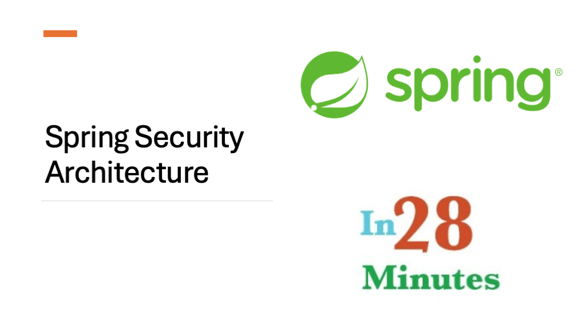

# Spring Security Overview

**Spring Security** is the standard and customizable framework for authentication and authorization in the Spring ecosystem. It provides a robust and standardized way to secure Spring-based applications, ensuring consistent and reliable protection across your application.

---
## 🔑 Key Features of Spring Security

1. **Comprehensive and extensible authentication and authorization** – Supports a wide range of authentication mechanisms and customizable authorization strategies.
2. **Built-in protection against common security threats** – Guards against session fixation, clickjacking, Cross-Site Request Forgery (CSRF), and more.
3. **Seamless integration with the Servlet API** – Works directly with the standard Java Servlet API for low-level security configuration.
4. **Optional integration with Spring Web MVC** – Easily integrates with Spring MVC for method-level and URL-based security.

---

## 🎯 Understanding the Goals of Spring Security

Before diving into Spring Security, let’s explore two of its core goals: **authentication** and **authorization**.

### 🔐 Authentication

Authentication is the process of verifying the identity of the user trying to access a resource. The most common method is requiring a username and password. Once a user is authenticated, we know *who* they are.

> **In simple terms:** Authentication verifies **WHO** the user is.

### 🔓 Authorization

Authorization determines what actions or resources an authenticated user is allowed to access. Spring Security supports both request-based and method-based granular access control.

> **In simple terms:** Authorization defines **WHAT** the user can access.

In addition, it will also carry out the following tasks: 

- Password Encoding
- Role based access control (RBAC)
- Session Management
- OAuth2, JWT, and more

## Spring Security Architecture

#### Architecture Components

  - Filters & FilterChain
  - DelegatingFilterProxy
  - FilterChainProxy
  - SecurityFilterChain
  - SecurityFilters

## Comprehensive Spring Security Authentication Flow

### Core Components and Servlet Filters

| Component | Description |
|-----------|-------------|
| **Client Request** | Entry point where users/clients send requests to the application |
| **Filters & FilterChain** | Standard Jakarta/Servlet filters that process HTTP requests and responses in a chain |
| **DelegatingFilterProxy** | Special filter that bridges the Servlet container's filter system with Spring's application context |
| **FilterChainProxy** | Spring Security's master filter that contains and delegates to all security filter chains |
| **SecurityFilterChain** | A chain of Spring Security-specific filters configured for specific URL patterns |
| **SecurityFilters** | Individual security filters that each handle specific security concerns |
| **JWT Authentication Filter** | Specific filter that extracts and validates JWT tokens from requests |
| **Dispatcher Servlet** | Front controller that handles all incoming HTTP requests and delegates to appropriate handlers |
| **HttpRequestHandlerAdapter** | Adapter that allows HttpRequestHandlers to be used as handlers in the Spring MVC framework |

## Authentication Components

| Component | Description |
|-----------|-------------|
| **UsernamePassword Authentication Token** | Container for authentication credentials (username/password or JWT) |
| **Authentication Manager** | Orchestrates the authentication process and delegates to providers |
| **DaoAuthenticationProvider** | Handles username/password authentication using UserDetailsService |
| **JWTAuthenticationProvider** | Processes and validates JWT tokens |
| **Authentication Provider N** | Represents extensibility for additional authentication methods |

## Supporting Services

| Service | Function |
|---------|----------|
| **PasswordEncoder** | Handles secure password verification and encoding |
| **UserDetailsService** | Loads user information from the database |
| **OAuth2ResourceServer** | Validates OAuth2/JWT tokens |
| **Database** | Stores user credentials and details |

## Security Context

The **SecurityContextHolder** maintains authentication information with:
- **SecurityContext** containing:
- **Authentication** object with:
    - **Principal**: The authenticated user identity
    - **Credentials**: Password or token information
    - **Authorities**: User roles and permissions

## Filter Architecture and Processing Flow

1. Client sends HTTP request to application
2. Request passes through Servlet container's standard filters
3. **DelegatingFilterProxy** intercepts the request and delegates to **FilterChainProxy**
4. **FilterChainProxy** (aka springSecurityFilterChain) determines which **SecurityFilterChain** matches the request URL
5. The matched **SecurityFilterChain** processes the request through its series of **SecurityFilters**:
   - Security Context Persistence Filter: Restores/creates Security Context
   - CORS Filter: Handles Cross-Origin requests
   - CSRF Filter: Protects against CSRF attacks
   - Logout Filter: Processes logout requests
   - **JWT Authentication Filter**: Extracts and validates JWT tokens
   - Exception Translation Filter: Converts Spring Security exceptions to HTTP responses
   - Authorization Filter: Enforces access control rules
6. If authentication is needed, the Authentication Manager is invoked
7. Authentication Manager delegates to appropriate provider(s)
8. User details are loaded from database if necessary
9. Authentication result is stored in Security Context
10. If authentication and authorization succeed, request proceeds to **Dispatcher Servlet**
11. Dispatcher Servlet routes to appropriate controller/handler
12. Handler processes the request with access to the Security Context
13. Response travels back through filter chain in reverse order
14. Security Context is cleared or persisted as needed

## Key Relationships and Principles

- **DelegatingFilterProxy** bridges the gap between Servlet container and Spring application context
- **FilterChainProxy** centralizes security filter management and selection
- Multiple **SecurityFilterChain** instances can exist for different URL patterns with different security configurations
- Each **SecurityFilter** has a specific security responsibility, following single responsibility principle
- Filters execute in a carefully determined order to ensure proper security processing
- Authentication Manager uses multiple providers to support different authentication methods
- SecurityContextHolder makes authentication details available throughout request processing
- JWT authentication integrates with OAuth2ResourceServer for token validation